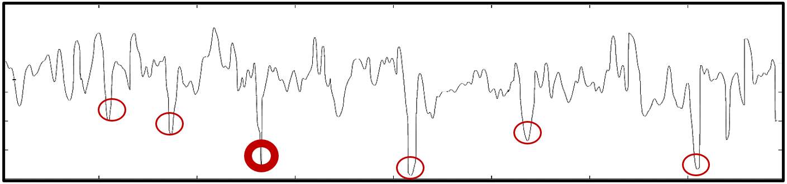
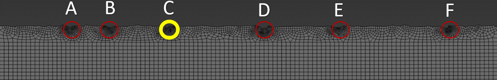
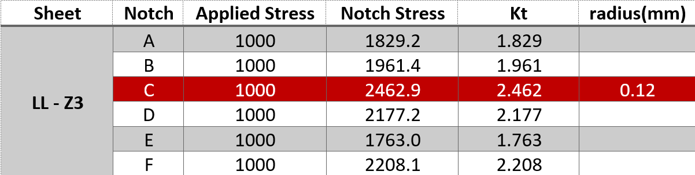

# Fatigue-Life-Estimation__LEFM-method

In this phase of the problem, a more comprehensive approach has been adopted, involving the analysis and evaluation of multiple parameters by dividing the problem into three fundamental issues. These issues are as follows:

### Issue 1: Fatigue Life Calculation for Constant Loading (Without Considering Negative Residual Stress)
The first issue involves the calculation of fatigue life for constant loading, without accounting for the effect of negative residual stress. This entails the utilization of the R-Ratio, Walker, and Forman methods to calculate the fatigue life. Additionally, the stress intensity geometric function for existing notches has been extracted and reported from analytical sources and FEM, enriching the problem-solving process with valuable data.

### Issue 2: Fatigue Life Calculation for Constant Loading (Considering Negative Residual Stress)
The second issue focuses on recalculating the fatigue life for constant loading while considering the effect of negative residual stress, as reported in . This recalibration is achieved through the application of the Walker and Forman methods, incorporating the influence of negative residual stress on the fatigue life determination process.

### Issue 3: Fatigue Life Calculation for Overload Spectrum (Considering Negative Residual Stress)
The third problem pertains to the calculation of fatigue life for the overload spectrum under different conditions, while considering the effect of negative residual stress. To address this, two general methods are employed for fatigue life calculation. The first method involves life assessment through the calculation of equivalent stress, while the second method integrates the evaluation of the Over Load in the loading spectrum using the Walker method, with the support of the Wheeler model.

These meticulous investigations and calculations represent a comprehensive and rigorous approach to addressing the complexities of fatigue life determination under varying loading conditions, integrating advanced methodologies and analytical techniques.

# Input Date
## Critical notches
The critical notches of an unsmooth surface has been distinguished by implimentation of PSD algorithm. The critical notches and their geometries are provided in Figure 1.

  

The surface geometry including its notches has been modeled and meshed in Abaqus CAE as Figure 2.

  

The extracted concentraion factors for each critical notch also are prepared by FEA simulation as Figure 3.

  

## Loading
Three different loading conditions are considered in order to investigate loading effect.
- Constant Loading
- Variable load | Compressive overload
- Variable load | Tensile overload

## Material Properties
Material properties related to Walker and Forman models for fatigue life estimation are presented in Figure 4 and 5.

  

  

## Results & Additional Information
For further details (including related equations, additional data and results) and/or an in-depth discussion, please feel free to [reach out to me](mailto:fateme.s.ahangari@gmail.com). I am available to provide additional information related to topic.

## References
1. Reference [1]: Numerical modelling approach for considering effects of surface integrity on micro-crack formation
2. Reference [2]: Mechanical Behavior of Materials, N. E. Dowling
3. Reference [3]: Defect-based fatigue life prediction of L-PBF additive," Engineering Fracture Mechanics
